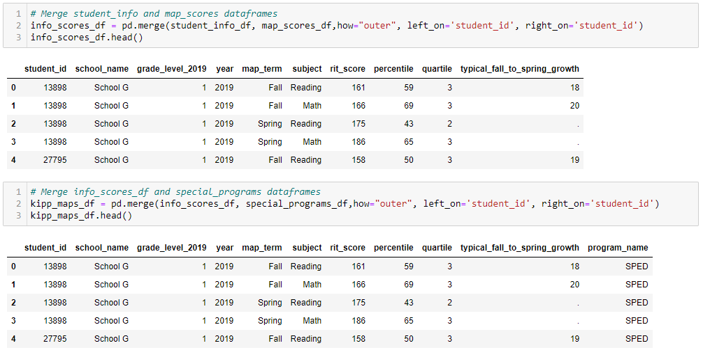
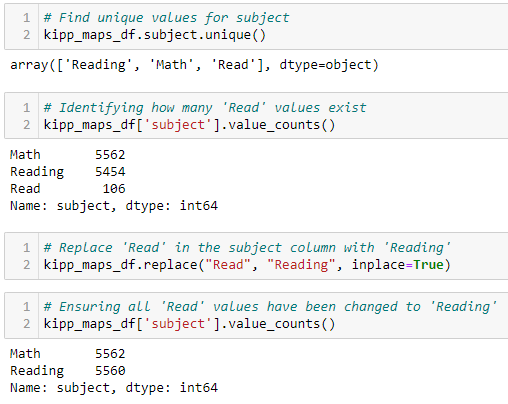
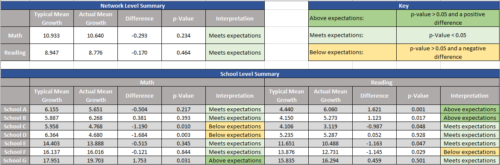
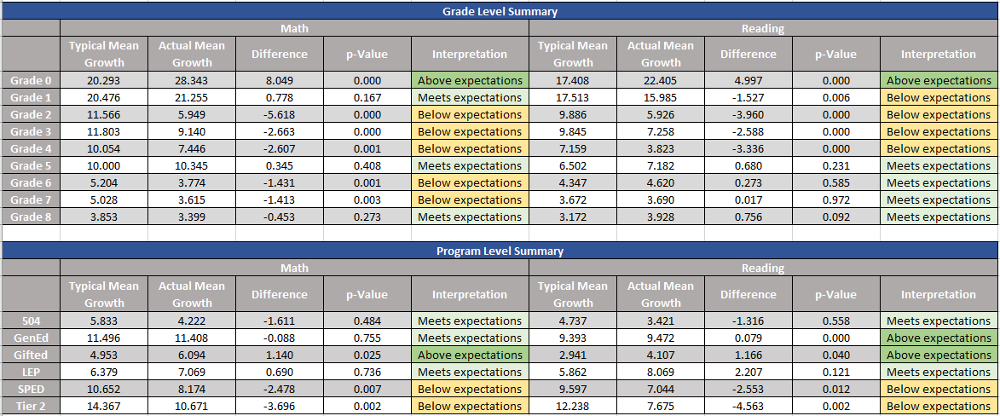
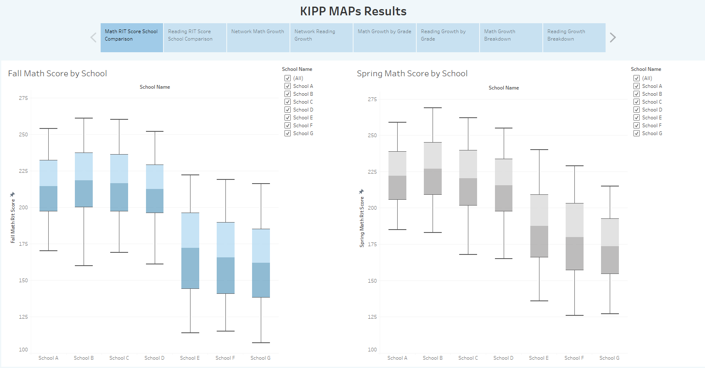
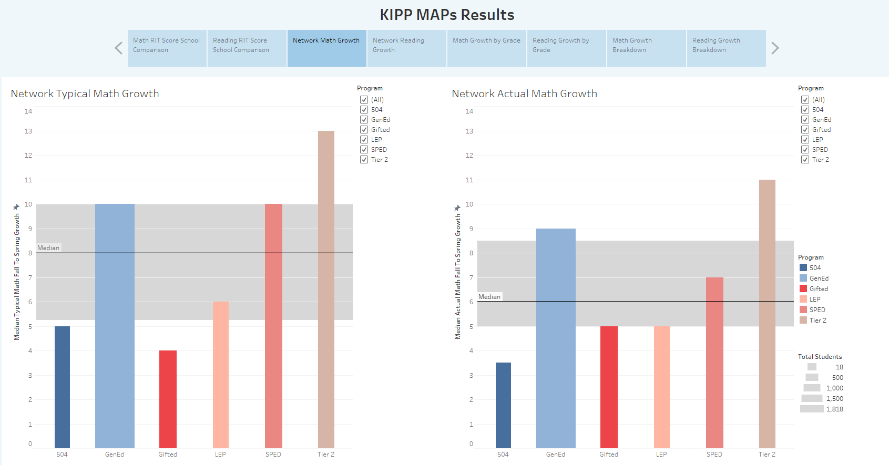
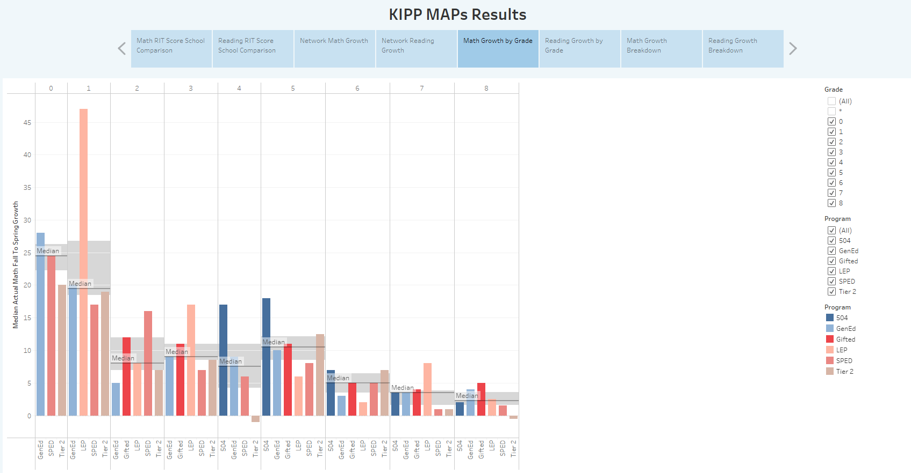
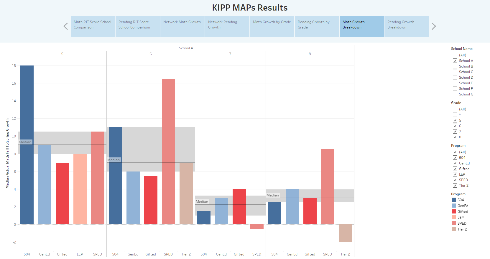

# KIPP_Performance_Task

## Overview
This analysis examines MAP scores for a Texas-based branch of a charter management organization (CMO). The investigation identifies key trends in the data and provides visualizations to help a user digest and act on the findings. 

## Entity Relationship Diagram & Merging
Each of the three available CSV tabs (Student_Info, MAP_Scores, and Special_Programs) have a unique identifier that can be used as both a primary and foreign key: student_id. The entity relationship diagram below depicts the features of each of the three CSV files and shows how they are combined into one file using SQL. 

## Data Cleaning
All data cleaning was completed in either Jupyter Notebook or Excel. Jupyter notebook was used to merge the separate tabs from the given Google Sheet into one dataframe, do basic cleaning on the data, and export CSVs for use in Tableau. Excel was used to merge data, so that each student had one row with all scores pertaining to that student rather than a row for each instance and subject of testing. Below are a few examples of the data cleaning process: 

**Merging Dataframes**

**Cleaning The Subject Column**: Turning cell from 'Read' to 'Reading'.

## Growth Data Analysis
Below are tables showing the mean typical growth for math and reading broken down by various identifiers (school, grade level, and program). A t-test was used between the typical mean growth and the actual mean growth to determine whether results were statistically significant and whether results met or were above or below expectations. 

## Data Visualization
All data visualization was completed using a Tableau Public data story. The visualizations below are meant to show a sample of what is provided in the Tableau Story, but the user is invited to click the link, manipulate their own visualizations, and draw conclusions. [The KIPP Performance Task data story](https://public.tableau.com/app/profile/amanda.palenchar/viz/KIPPPerformanceTask/KIPPMAPsResults) has multiple pages that are meant to be utilized with the following in mind: 

- **Math RIT Score School Comparison** & **Reading RIT Score School Comparison**: The boxplots are meant to support network level and school based admin in understanding school overall performance (spread of data, median improvement, etc.). The school filter on the right can be used to narrow down search fields to make relevant comparisons (i.e. middle school to middle school).

- **Network Math Growth** & **Network Reading Growth**: Visuals are best used by network level admin to compare typical and actual growth from fall to spring and is broken down by program. Bar widths represent student population. This visual could support general understanding of network level special services.

- **Math Growth Rate by Grade** & **Reading Growth by Grade**: Visuals are best used by network level admin to compare growth from fall to spring by grade. Mousing over each bar will show growth numbers and the number of students represented by the bar. This visual could support understanding of grade level curriculum effectiveness and help to further zoom in on special services.

- **Math Growth Breakdown** & **Reading Growth Breakdown**: Visuals are best used by those focused on school level data (principal coaches, school admin, grade level leaders, etc.). Users are meant to utilize the filters on the right side of the screen to narrow their search for specific schools, grades, or programs in order to learn more specifically about their school or make relevant comparisons.

## Conclusions
With so many ways to cut data (subject, school, grade, program, etc.), there are infinite combinations of slicing and conclusions to be drawn depending on your frame of reference within the network (i.e. a school administrator at School A vs. a SPED teacher at school F). This analysis, however, will focus on high level, network-wide conclusions, keeping in mind that visualizations are provided in the Tableau to investigate more nuanced facets of the data.

Below are three important conclusions that can be drawn after inspecting the Growth Data Analysis: 
1. **Network**: This data indicates that this network overall met its growth expectations for both math and reading. 
2. **Special Programs**: GenEd students and some special programs met their growth goals for 2019: GenEd (reading was above expectations), 504, and LEP. Gifted students were above their growth expectations for both subjects. However, students with disabilities or who are on Tier 2 plans were below expecatations for both math and reading across the network. This might prompt an investigation into the services being provided across all groups.
3. **Grade Level**: Grade 0, which is assumed to be kindergarten, is exceeding expectations for both math and reading. This is the only grade level to accomplish that task and should be celelbrated. Additionally, all of middle school reading is meeting expectations.  

## Considerations & Assumptions
In diving into the data, a few assumptions needed to be made due to a minor lack of context for this particular CMO. If afforded the opportunity to work at KIPP, I would ask questions and seek to flesh out some of the following questions: 
- **Grade 0**: This was assumed to be kindergarten and kept before grade 1 in all visuals.
- **Null Values for Programs**: These cases were assumed to be GenEd students, but would be investigated properly in a real world setting. 
- **Missing Test Scores**: These values (about 10% of the overall data) were left out of the calculations. Filling their values with means was considered, so not to skew the data. However, the values were dropped because of not wanting to skew incredibly small sample sizes in the visualizations (i.e. grade 1, SWDs in school A). 
