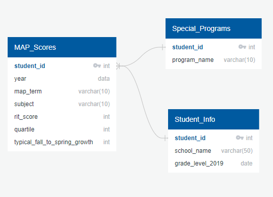

# KIPP_Performance_Task

## Overview
This analysis examines MAP scores for a Texas-based branch of a charter management organization (CMO). The investigation identifies key trends in the data and provides visualizations to help a user digest and act on the findings. 

## Data Cleaning

## Entity Relationship Diagram & Merging
Each of the three available CSV tabs (Student_Info, MAP_Scores, and Special_Programs) have a unique identifier that can be used as both a primary and foreign key: student_id. The entity relationship diagram below depicts the features of each of the three CSV files and shows how they are combined into one file using SQL. 

## Data Visualization

## Conclusions

## Considerations
